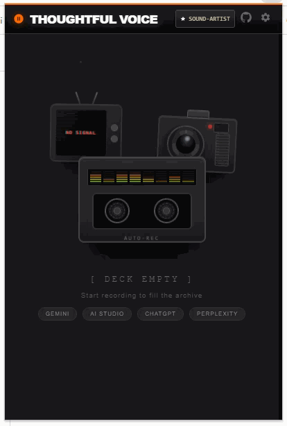
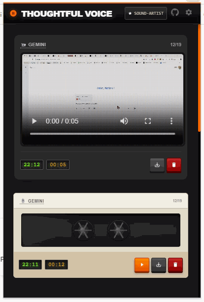
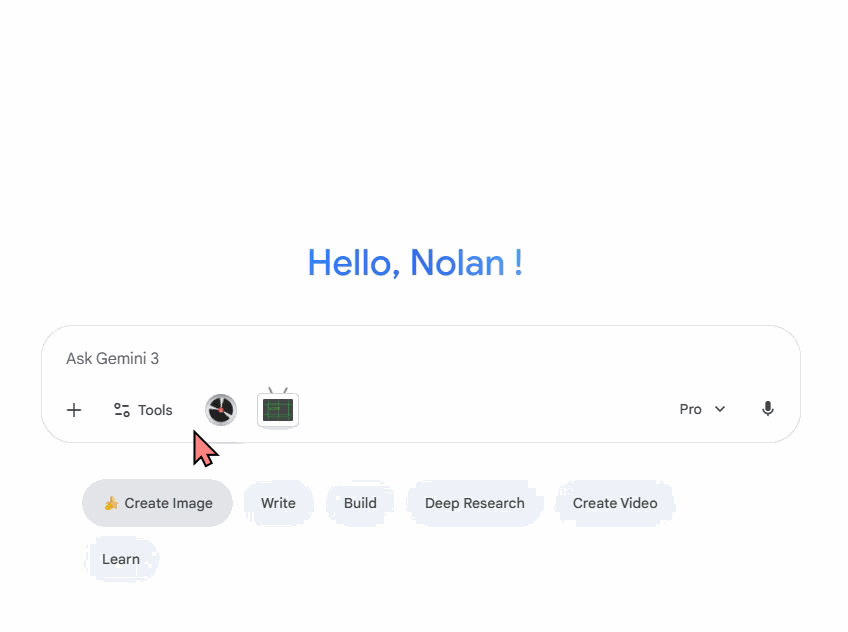
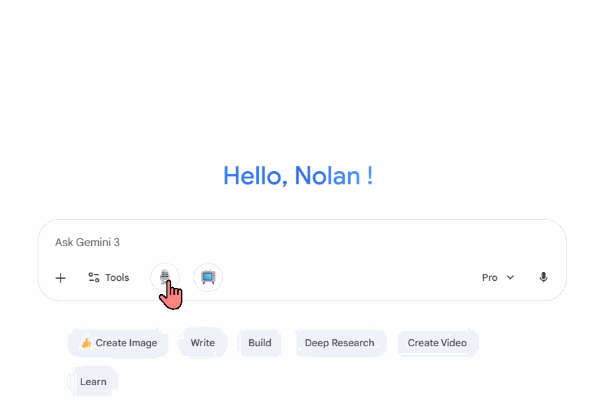

# 🎙️ Thoughtful Voice

<div align="center">


**Voice and screen recording for Gemini and ChatGPT**

Record your voice or screen and submit directly to AI - no transcription errors, no interruptions.

[](https://chromewebstore.google.com/detail/jpcnegghcigeekjdaiakedigfdhkmpdl)
[](LICENSE)
[](https://github.com/NolanEYeee/Thoughtful-Voice/releases)
[](https://buymeacoffee.com/nolaneyeee)

[Features](#-features) • [Platforms](#-platform-support) • [Installation](#-installation) • [Use Cases](#-use-cases) • [Development](#-development)

English | [简体中文](README_CN.md)

</div>

## 🎯 About Thoughtful Voice


AI voice typing and real-time screen sharing have limitations:
- Voice typing produces transcription errors that need manual correction
- Real-time screen sharing interrupts your explanation flow
- Complex tasks are hard to describe in text alone

This extension lets you record audio and screen content, then submit it as a complete package. The AI processes your actual voice and video, maintaining full context without interruptions.

## 📸 Screenshots

### Main Interface - Retro Walkman
<div align="center">
  <table>
    <tr>
      <td width="50%">
        
      </td>
      <td width="50%">
        
      </td>
    </tr>
  </table>
  <p><i>Left: Empty State Page | Right: Retro Interface</i></p>
</div>

### In-Action Recording

The extension offers **two UI styles**:

#### 🎨 Default Style
<div align="center">
  
  <p><i>Better looking style - 80s Walkman vibes</i></p>
</div>

#### ⚡ Minimalist Style
<div align="center">
  
  <p><i>Simple button design, lightweight and efficient</i></p>
</div>

**Shared Features**: Both UIs support **Pause/Resume** anytime and **Mute/Unmute** microphone on-the-fly during voice or screen recording

## ✨ Features

| Feature | Description |
|---------|-------------|
| 🎤 Voice Recording | WAV format, adjustable bitrate, download & save locally, auto-upload |
| 📹 Screen Recording | Up to 4K@120FPS, adjustable bitrate, download & save locally, auto-fix duration metadata |
| 🎨 Retro UI | 80s Walkman style, cassette/CRT design, browse by date & platform |
| ⚙️ Customization | Video/audio quality settings, default prompts, auto-save preferences |
| 🔍 Provenance | Auto-track recording origins; one-click jump back to specific AI chat windows |

## 🌐 Platform Support

| Platform | Domain | Status |
|----------|--------|--------|
| Gemini ⭐ | gemini.google.com | ✅ Supported (Recommended) |
| AI Studio ⭐ | aistudio.google.com | ✅ Supported (Recommended) |
| ChatGPT | chatgpt.com, chat.openai.com | ✅ Supported |
| Perplexity | perplexity.ai | ⚠️ UI Only (Site Issuem, not my problem huh) |
| Perplexity Comet | - | ❌ Unsupported (Home page immutable) |
| Claude | claude.ai | ❌ Unsupported (No audio/video upload) |
| Grok | x.com/i/grok grok.com | ❌ Unsupported (No audio/video upload) |

**⭐ Recommended for Gemini & AI Studio**: Gemini natively supports ultra-long contexts, multimodal input (audio + video), and is very generous with context, making it difficult to reach limits.

## 🚀 Installation

### Option 1: Install from Chrome Web Store (Recommended) 🎯

[](https://chromewebstore.google.com/detail/jpcnegghcigeekjdaiakedigfdhkmpdl)

1. **Visit Chrome Web Store**
   - Click to visit the [Chrome Web Store link](https://chromewebstore.google.com/detail/jpcnegghcigeekjdaiakedigfdhkmpdl)
   - Click "Add to Chrome" button
   - Confirm installation, and the extension icon will appear in your toolbar!

**Benefits**: Auto-updates, secure & trusted, one-click installation

### Option 2: Download from Releases

1. **Download the Latest Release**
   - Visit [Releases](https://github.com/NolanEYeee/Thoughtful-Voice/releases)
   - Download `thoughtful-voice-v*.*.zip` from the latest release
   - Extract the ZIP file to a folder

2. **Load in Chrome**
   - Open Chrome and navigate to `chrome://extensions/`
   - Enable **Developer mode** (toggle in top-right corner)
   - Click **Load unpacked**
   - Select the extracted folder
   - The extension icon should appear in your toolbar!

### Option 3: Build from Source

1. **Clone the Repository**
   ```bash
   git clone https://github.com/NolanEYeee/Thoughtful-Voice.git
   cd Thoughtful-Voice
   ```

2. **Install Dependencies**
   ```bash
   npm install
   ```

3. **Build the Extension**
   ```bash
   npm run build
   ```

4. **Load in Chrome**
   - Open Chrome and navigate to `chrome://extensions/`
   - Enable **Developer mode** (toggle in top-right corner)
   - Click **Load unpacked**
   - Select the `Thoughtful-Voice` folder
   - The extension icon should appear in your toolbar!

## 💼 Use Cases

### Complex Data Tasks
Upload an Excel file, show the data on screen, and explain what you need. The AI sees the actual structure and provides targeted solutions instead of generic formulas.

**Example:** "I need to calculate quarterly growth by region, but I'm not sure which columns to use or how to exclude outliers."

### Workflow Automation
Record yourself doing a multi-step process while narrating. Get automation scripts that match your actual workflow, not an idealized version.

**Example:** Screen record your daily copy-paste routine across different tools while explaining what you're doing and why.

### Code Debugging
Show your code, run it, let the error happen - all while explaining your thought process. The AI sees the full context and can spot issues you might not mention in text.

### Process Documentation
Explain a workflow by demonstrating it. Like explaining to a colleague, but the AI remembers everything perfectly.

**Example:** Show a messy downloads folder and explain how you want files auto-organized by type.

## 🛠️ Development

### Tech Stack

- **Frontend**: Vanilla JavaScript (ES6+), HTML5, CSS3
- **Build Tool**: esbuild
- **APIs**: MediaRecorder API, Chrome Extension API
- **Storage**: Chrome Storage API

### Building from Source

```bash
# Install dependencies
npm install

# Build the extension
node build.js

# The built files will be in the dist/ folder
```

### Contributing

Contributions are welcome! Please feel free to submit a Pull Request.

1. Fork the repository
2. Create your feature branch (`git checkout -b feature/AmazingFeature`)
3. Commit your changes (`git commit -m 'Add some AmazingFeature'`)
4. Push to the branch (`git push origin feature/AmazingFeature`)
5. Open a Pull Request

## 🐛 Known Issues

- **WebM Duration**: Fixed automatically using `fix-webm-duration` library
- **Platform Changes**: AI platforms may update their UI; we'll keep the extension current
- **Perplexity Uploads**: As of 2025/12/19, Perplexity has site-side issues preventing audio/video uploads. The extension supports button injection, but the site may fail to process files.
- **Grok / Claude Support**: Grok / Claude currently does not support audio or video file uploads on its website, so it cannot be supported at this time.

## 🗺️ Roadmap

- [x] Chrome Web Store publication ✅
- [ ] Support for more AI platforms (Poe, Qwen, etc.)

## 📄 License

This project is licensed under the **Creative Commons Attribution-NonCommercial-ShareAlike 4.0 International License**. 

You are free to use, share, and modify this extension for **non-commercial purposes only**. See the [LICENSE](LICENSE) file for complete details (including a clarification on internal organizational use).

## 📧 Contact

**Developer**: NolanEYeee

- GitHub: [@NolanEYeee](https://github.com/NolanEYeee)
- Twitter/X: [@owoNonlan](https://x.com/owoNonlan)
- Project Link: [https://github.com/NolanEYeee/Thoughtful-Voice](https://github.com/NolanEYeee/Thoughtful-Voice)

<div align="center">

**⭐ If you find this extension helpful, please give it a star!**

Made with ❤️

</div>
