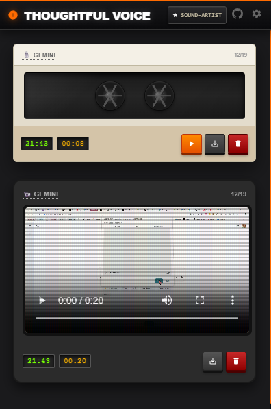
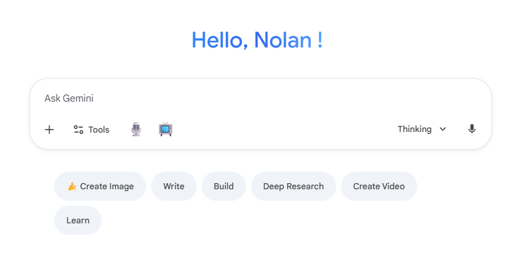

# 🎙️ Thoughtful Voice

<div align="center">


**为 Gemini 和 ChatGPT 提供口述錄音和屏幕录制功能**

录制口述錄音或屏幕內容，直接提交给 AI - 不会识别错误，不会被打断。

[](https://github.com/NolanEYeee/Thoughtful-Voice)
[](LICENSE)
[](https://github.com/NolanEYeee/Thoughtful-Voice/releases)

[功能特性](#-功能特性) • [安装指南](#-安装指南) • [使用场景](#-使用场景) • [开发指南](#-开发指南)

[English](README.md) | 简体中文

</div>

---

## 🎯 为什么做这个

AI 语音输入和实时屏幕共享都有局限性：
- 即便 AI 语音输入也会识别错误，需要手动修正
- 实时屏幕共享会打断你的讲解思路
- 复杂任务用文字很难描述清楚

这个插件讓你先錄製口述錄音和屏幕內容，然後作為完整的包提交。AI 处理的是你的原始语音和视频，保持完整上下文，不会被打断。

---

## ✨ 功能特性

### 🎤 口述錄音
- 点击开始/停止录音
- WAV 格式，支持调节比特率
- 录音自动上传到 Gemini 或 ChatGPT
- 可选自定义提示词为 AI 提供上下文

### 📹 屏幕录制
- 录制整个屏幕或指定窗口
- 最高支持 1080p @ 60 FPS
- 可调节比特率（2.5-20 Mbps）
- 自动修正 WebM 视频时长元数据

### 🎨 复古界面
- 80 年代随身听风格设计
- 音频录音显示为磁带样式
- 视频录音显示在 CRT 显示器上
- 按日期和平台浏览录音历史

### ⚙️ 自定义设置
- 配置视频/音频质量参数
- 设置上传媒体的默认提示词
- 所有偏好自动保存

### 🌐 平台支持
- ChatGPT (chatgpt.com, chat.openai.com)
- Gemini (gemini.google.com)

---

## 📸 截图展示

### 主界面 - 复古随身听设计
<div align="center">
  
  <p><i>音频录音采用复古磁带设计，视频采用 CRT 显示器设计</i></p>
</div>

### 实时录制
<div align="center">
  
  <p><i>在 Gemini 和 ChatGPT 中无缝集成的录制按钮</i></p>
</div>

---

## 🚀 安装指南

### 方式一：Chrome 应用商店安装（即将推出）
*扩展目前正在审核中，敬请期待！*

### 方式二：手动安装

1. **下载扩展**
   ```bash
   git clone https://github.com/NolanEYeee/Thoughtful-Voice.git
   cd Thoughtful-Voice
   ```

2. **安装依赖**
   ```bash
   npm install
   ```

3. **构建扩展**
   ```bash
   node build.js
   ```

4. **在 Chrome 中加载**
   - 打开 Chrome 并访问 `chrome://extensions/`
   - 启用右上角的**开发者模式**
   - 点击**加载已解压的扩展程序**
   - 选择 `Thoughtful-Voice` 文件夹
   - 扩展图标应该会出现在工具栏中！

---

## 💼 使用场景

### 复杂数据任务
上传 Excel 文件，展示数据，说明你需要什么。AI 看到实际结构，给出针对性方案而非通用公式。

**示例：** "我需要算各地区季度增长率，但不确定用哪些列，也不知道怎么排除异常值。"

### 工作流自动化
录制你的多步骤操作过程并配上讲解。得到匹配实际工作流的自动化脚本，不是理想化版本。

**示例：** 录屏你日常在不同工具间复制粘贴的流程，边做边说明在做什么、为什么这么做。

### 代码调试
展示代码、运行、让错误出现 - 同时解释你的思路。AI 看到完整上下文，能发现你可能不会在文字中提到的问题。

### 流程说明
通过演示来解释工作流程。像跟同事解释一样，但 AI 会完美记住所有细节。

**示例：** 展示凌乱的下载文件夹，说明你希望按类型自动整理文件。

---

## 🛠️ 开发指南

### 技术栈

- **前端**：原生 JavaScript (ES6+)、HTML5、CSS3
- **构建工具**：esbuild
- **API**：MediaRecorder API、Chrome Extension API
- **存储**：Chrome Storage API
- **设计**：自定义 CSS，含玻璃态和复古美学

### 项目结构

```
Thoughtful-Voice/
├── src/
│   ├── content/           # 注入到网页的内容脚本
│   │   ├── strategies/    # 平台特定注入策略
│   │   ├── main.js        # 主内容脚本
│   │   └── injector.js    # 按钮注入逻辑
│   ├── popup/             # 扩展弹窗 UI
│   │   └── popup.html     # 复古随身听界面
│   ├── styles/            # CSS 样式
│   └── utils/             # 辅助工具
├── dist/                  # 构建文件（自动生成）
├── icons/                 # 扩展图标
├── manifest.json          # Chrome 扩展清单
└── build.js               # 构建配置
```

### 从源码构建

```bash
# 安装依赖
npm install

# 构建扩展
node build.js

# 构建文件将在 dist/ 文件夹中
```

### 贡献指南

欢迎贡献！请随时提交 Pull Request。

1. Fork 本仓库
2. 创建你的功能分支 (`git checkout -b feature/AmazingFeature`)
3. 提交你的更改 (`git commit -m 'Add some AmazingFeature'`)
4. 推送到分支 (`git push origin feature/AmazingFeature`)
5. 开启一个 Pull Request

---

## 🐛 已知问题

- **WebM 时长**：使用 `fix-webm-duration` 库自动修复
- **平台变化**：AI 平台可能会更新其 UI；我们会保持扩展同步更新

---

## 🗺️ 发展路线图

- [ ] 发布到 Chrome 应用商店
- [ ] 支持更多 AI 平台（Claude、Poe 等）
- [ ] 键盘快捷键
- [ ] 多语言支持

---

## 📄 许可证

本项目采用 **知识共享署名-非商业性使用-相同方式共享 4.0 国际许可协议** (CC BY-NC-SA 4.0)。

你可以自由使用、分享和修改这个扩展，但**仅限于非商业用途**。详见 [LICENSE](LICENSE) 文件。

---

## 📧 联系方式

**开发者**：NolanEYeee

- GitHub: [@NolanEYeee](https://github.com/NolanEYeee)
- 项目链接：[https://github.com/NolanEYeee/Thoughtful-Voice](https://github.com/NolanEYeee/Thoughtful-Voice)

---

<div align="center">

**⭐ 如果你觉得这个扩展有帮助，请给个Star！**

用 ❤️ 制作

</div>
